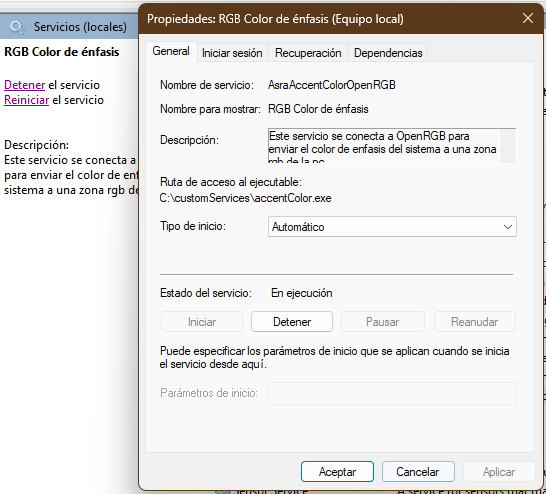
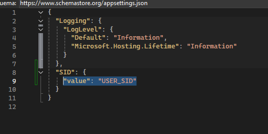
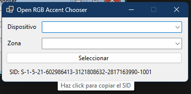

# OpenRGB Accent Color Service

**OpenRGB Accent Color Service** es un servicio de Windows que se conecta al servidor SDK de OpenRGB y cambia en tiempo real los LEDs de un dispositivo previamente seleccionado. La selección del dispositivo se realiza con el repositorio [OpenRGB Accent Chooser](https://github.com/smukideejeah/OpenRGB-Accent-Chooser), que guarda la configuración en el registro de Windows.

## Ejemplo de funcionamiento



## Requisitos
- Windows 10 o superior
- [OpenRGB instalado](https://openrgb.org/)
- OpenRGB SDK Server activo
- [OpenRGB Accent Chooser](https://github.com/smukideejeah/OpenRGB-Accent-Chooser)
- OpenRGB SDK Server activo
- .NET (versión requerida por el proyecto)

## Instalación y configuración

1. **Renombra los archivos de configuración:**

   Cambia el nombre de los archivos:
   - `appsettings.example.json` → `appsettings.json`
   - `appsettings.example.Development.json` → `appsettings.Development.json`

   

2. **Configura el SID del dispositivo:**

   - Abre **OpenRGB Accent Chooser**.
   - Copia el **SID** del dispositivo seleccionado.
   - Pega el SID en el archivo `appsettings.json` en la sección correspondiente.

   

3. **Compila y publica el proyecto:**

   - Compila el código fuente.
   - Publica el ejecutable del servicio.

4. **Instala el servicio en Windows:**

   Ejecuta el siguiente comando en PowerShell como administrador (reemplaza `"ruta\del\servicio.exe"` por la ruta real del ejecutable):

   ```powershell
   New-Service -Name "AsraAccentColorOpenRGB" -BinaryPathName "ruta\del\servicio.exe" -DisplayName "RGB Color de énfasis" -Description "Este servicio se conecta a OpenRGB para enviar el color de énfasis del sistema a una zona RGB de la PC" -StartupType Automatic

  ## Licencia

Este proyecto está licenciado bajo la [GPL-3.0](LICENSE.txt).